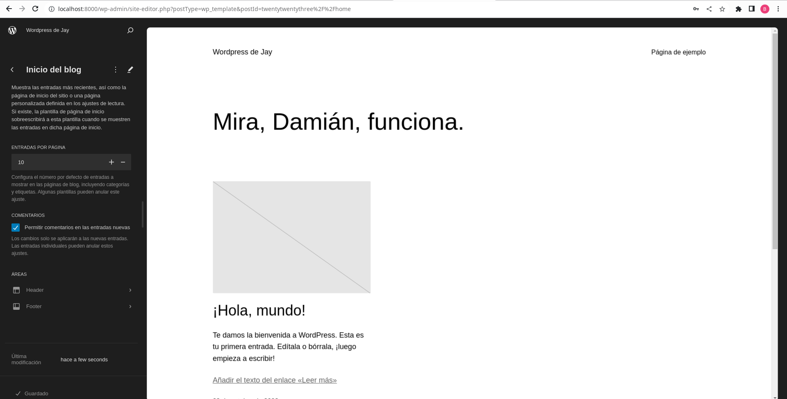

# Docker Compose - Wordpress

## Archivo .yml

```version: '3.3'

services:
   db:
     image: mysql:5.7
     ports:
       - "3307:3306"
     volumes:
       - db_data:/var/lib/mysql
     environment:
       MYSQL_ROOT_PASSWORD: somewordpress
       MYSQL_DATABASE: wordpress
       MYSQL_USER: wordpress
       MYSQL_PASSWORD: wordpress

   wordpress:
     depends_on:
       - db
     image: wordpress:latest
     ports:
       - "8000:80"
     volumes:
       - ./html:/var/www/html
     environment:
       WORDPRESS_DB_HOST: db:3306
       WORDPRESS_DB_USER: wordpress
       WORDPRESS_DB_PASSWORD: wordpress
       WORDPRESS_DB_NAME: wordpress
volumes:
    db_data: {}
```

## Explicación de parámetros

Este archivo YML es un archivo de configuración de Docker Compose, que se utiliza para definir y configurar aplicaciones de múltiples contenedores. En este archivo, se definen dos servicios: "db" y "wordpress", junto con algunos parámetros y configuraciones específicos para cada uno.

### version: '3.3'
Esta línea especifica la versión de la especificación de Docker Compose que se utiliza en este archivo. En este caso, se utiliza la versión 3.3.

### services
Esta sección define los servicios que forman parte de tu aplicación. En este caso, hay dos servicios: "db" y "wordpress".

### db:

- **db**: Es el servicio que ejecuta una instancia de MySQL 5.7 en un contenedor.
- **image**: Especifica la imagen de Docker que se utilizará para este servicio (mysql:5.7 en este caso).
- **ports**: Mapea el puerto 3307 del host a 3306 del contenedor, lo que permite que la base de datos sea accesible desde el host en el puerto 3307.
- **volumes**: Crea un volumen llamado "db_data" que se utiliza para persistir los datos de MySQL en el directorio `/var/lib/mysql` dentro del contenedor.
- **environment**: Define variables de entorno necesarias para la configuración de MySQL, como la contraseña de root, la base de datos, el usuario y la contraseña de WordPress.

### wordpress:
- **wordpress**: Este servicio depende del servicio "db" y ejecuta una instancia de WordPress en un contenedor.
- **depends_on**: Indica que este servicio depende de que el servicio "db" esté en funcionamiento antes de iniciarse.
- **image**: Especifica la imagen de Docker para WordPress (wordpress:latest).
- **ports**: Mapea el puerto 8000 del host al puerto 80 del contenedor, lo que permite acceder a WordPress desde el host en el puerto 8000.
- **volumes**: Monta un volumen desde el directorio local `./html` en el contenedor en `/var/www/html.`
- **environment**: Define variables de entorno necesarias para la configuración de WordPress, como la ubicación de la base de datos, el usuario y la contraseña.

### volumes

En esta sección, se define el volumen "db_data", que se utiliza para persistir los datos de MySQL. El objeto vacío `{}` indica que se utiliza la configuración predeterminada para el volumen.

## WordPress en funcionamiento

